# Stacker

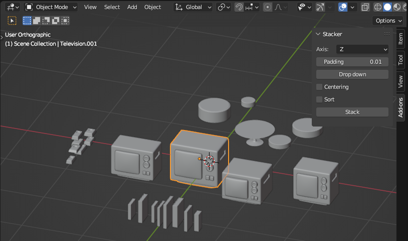

An add-on for Blender for putting things on top of other things.

Stacks objects with a single click.

## Source code (Python)
-  [Stacking logic](stacker.py).
-  [Blender plugin](stacker_addon.py).

## Stack operation

Vertical stacking:

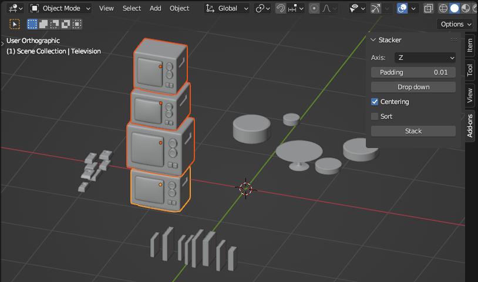

Horizontal stacking using a bounding box:

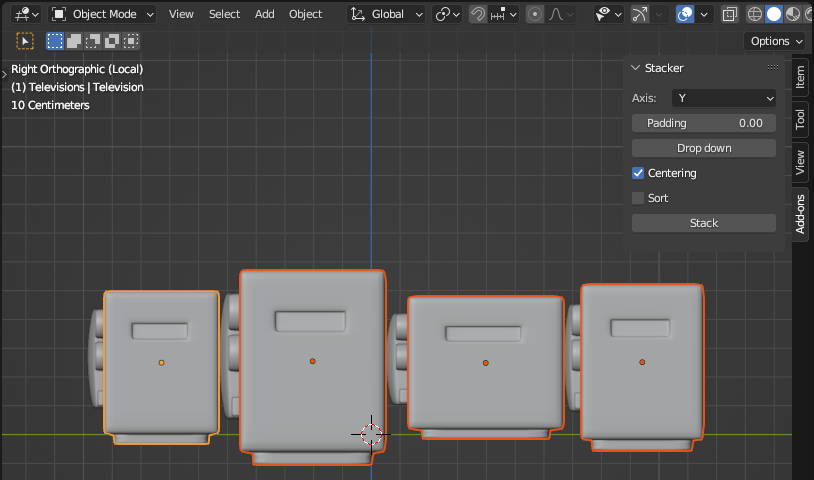

### Sorting

Books:

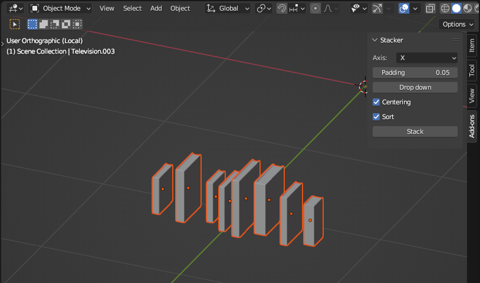

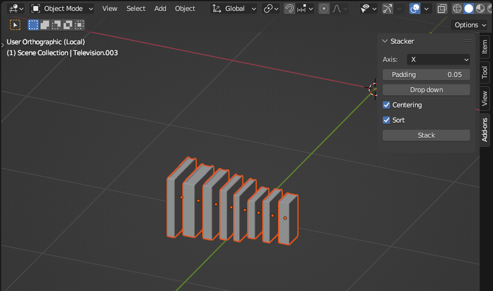

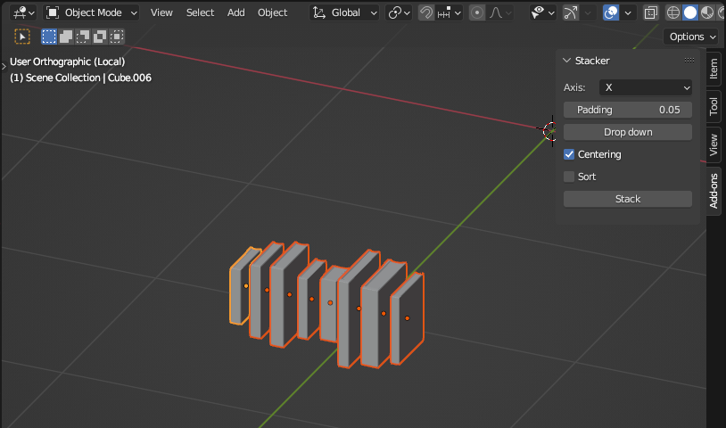

Cakes:

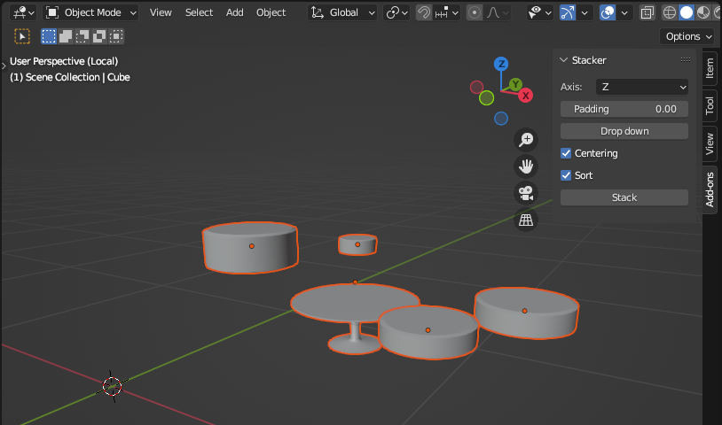

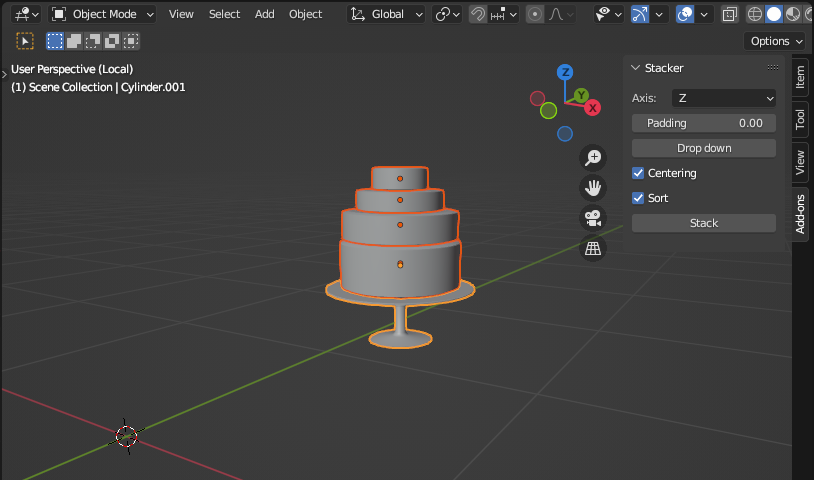

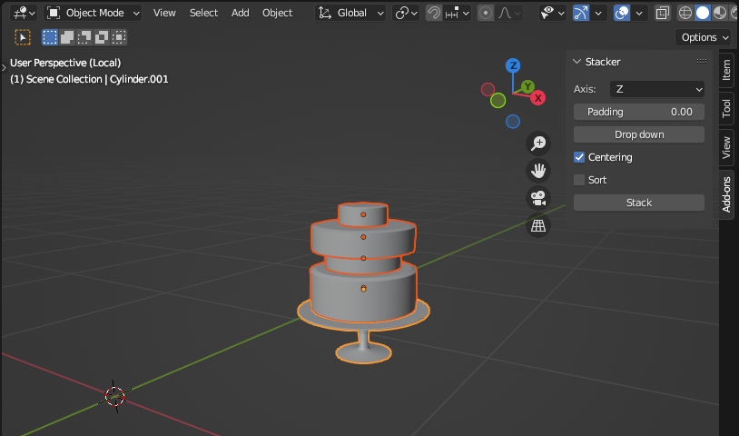

## Drop down operation

Books (alignment):

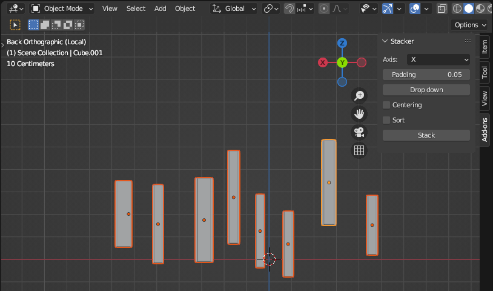

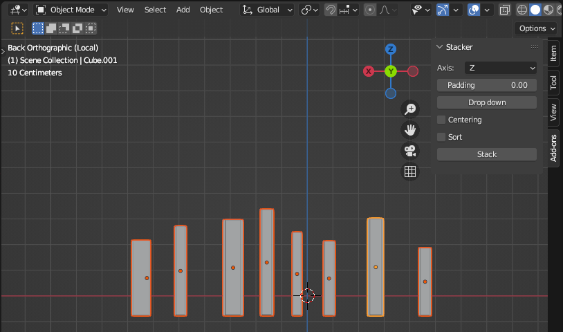

Bars (multiple columns):

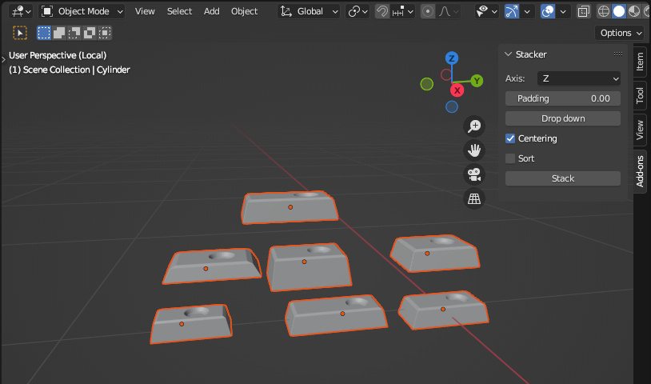

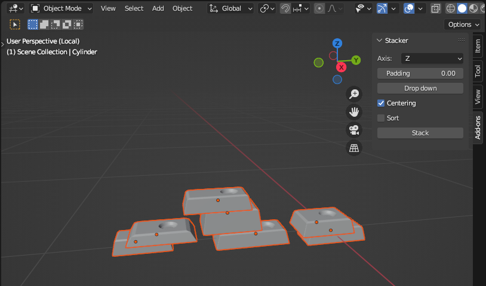
